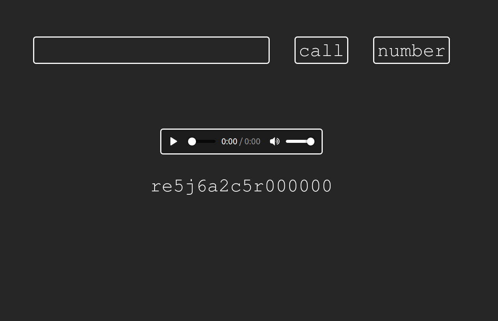

# Voiceapp
Geohot's Voiceapp to make P2P voice calls using a web browser

### PeerJS
JavaScript library that provides a P2P connection API by wrapping the browser's WebRTC (Web Real-Time Communication) implementation

### Instructions

- Click on number to generate a temporary number for our browser
- On the other browser, copy that number, paste onto the input area and press call
- Remember to allow permisions to browser when asked 

